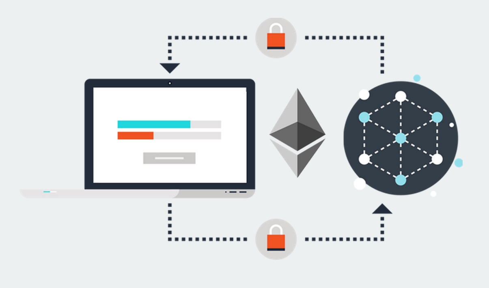
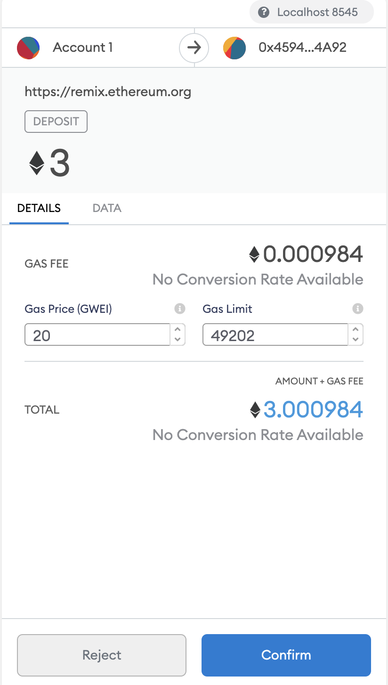
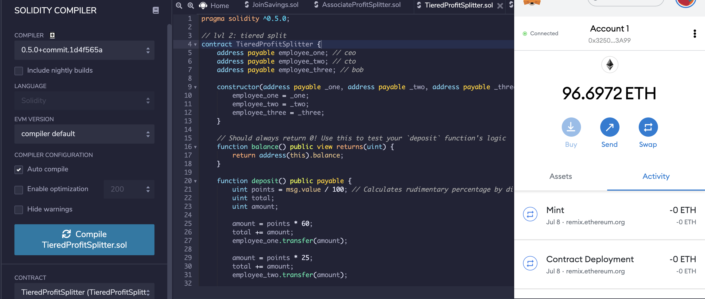

# Smart Contracts for Finance

## Background

In this project we have created 3 `ProfitSplitter` contracts. These contracts will do several things:

* Pay your Associate-level employees quickly and easily.

* Distribute profits to different tiers of employees.

* Distribute company shares for employees in a "deferred equity incentive plan" automatically.

* **Level One** is an `AssociateProfitSplitter` contract. This will accept Ether into the contract and divide the Ether evenly among the associate level employees. This will allow the Human Resources department to pay employees quickly and efficiently.

* **Level Two** is a `TieredProfitSplitter` that will distribute different percentages of incoming Ether to employees at different tiers/levels. For example, the CEO gets paid 60%, CTO 25%, and Bob gets 15%.

* **Level Three** is a `DeferredEquityPlan` that models traditional company stock plans. This contract will automatically manage 1000 shares with an annual distribution of 250 over 4 years for a single employee.

## Files

* [`AssociateProfitSplitter.sol`](AssociateProfitSplitter.sol) -- Level 1 

* [`TieredProfitSplitter.sol`](TieredProfitSplitter.sol) -- Level 2 

* [`DeferredEquityPlan.sol`](DeferredEquityPlan.sol) -- Level 3 

## Smart Contracts

### Level One: The `AssociateProfitSplitter` Contract

#### Test the contract

In the `Deploy` tab in Remix, deploy the contract to your local Ganache chain by connecting to `Injected Web3` and ensuring MetaMask is pointed to `localhost:8545`.

You will need to fill in the constructor parameters with your designated `employee` addresses.

Test the `deposit` function by sending various values. Keep an eye on the `employee` balances as you send different amounts of Ether to the contract and ensure the logic is executing properly.

### Check Inital Balance

### Send ETH

### Confirm Transaction

### Check Balances after transaction 

### Level Two: The `TieredProfitSplitter` Contract

In this contract, rather than splitting the profits between Associate-level employees, you will calculate rudimentary percentages for different tiers of employees (CEO, CTO, and Bob).

#### Test the contract

### Check Inital Balance

### Send ETH

### Confirm Transaction

### Check Balances after transaction 

### Level Three: The `DeferredEquityPlan` Contract

In this contract, we will be managing an employee's "deferred equity incentive plan" in which 1000 shares will be distributed over 4 years to the employee. We won't need to work with Ether in this contract, but we will be storing and setting amounts that represent the number of distributed shares the employee owns and enforcing the vetting periods automatically.

### Deploy the contracts to a live Testnet

Once you feel comfortable with your contracts, point MetaMask to the Kovan or Ropsten network. Ensure you have test Ether on this network!

After switching MetaMask to Kovan, deploy the contracts as before and copy/keep a note of their deployed addresses. The transactions will also be in your MetaMask history, and on the blockchain permanently to explore later.

### Deploy to Kovan Testnet

### Confirm on Kovan Etherscan

